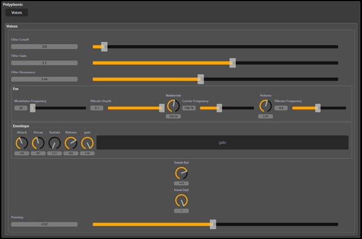

# Polyphonic Synthesizer in Faust Web IDE

This project is a **polyphonic synthesizer** designed in the [Faust Web IDE](https://faustide.grame.fr/), using FM synthesis and additional audio effects.

## Features

- **FM Synthesizer** with adjustable parameters:
  - Carrier frequency
  - Modulation index
  - Modulator frequency
  - Output gain

- **Vibrato**: Added via a low-frequency oscillator (LFO).

- **Envelope (ADSR)** with `gate` control (Mono mode).

- **Tremolo**: Amplitude modulation effect.

- **Band-pass filter**: Controls the frequency range.

- **Stereo panning**: Positions the signal in the stereo field.

## Interface Layout

The user interface is organized in the following order:
1. Filter controls  
2. FM synthesizer settings  
3. Envelope  
4. Tremolo  
5. Panning  

## Interface Screenshot

*From top to bottom: filter, FM synth, envelope, tremolo, panning.*

## Usage

Open the `.dsp` file in the Faust Web IDE or compile it into a plugin or standalone application using Faust's toolchain.
---

© 2024 – Project